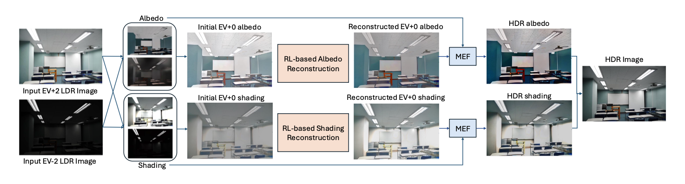
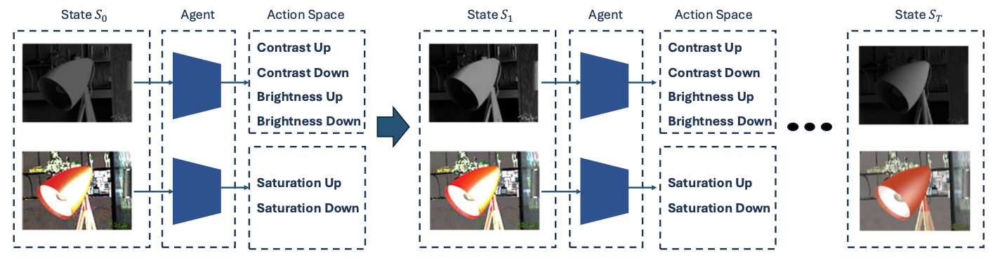

---

##### Download

+ [Thesis](HDR_RL.pdf)

---

##### Abstract

This project aims to leverage reinforcement learning (RL) techniques
for High Dynamic Range (HDR) reconstruction from Low Dynamic Range (LDR) images. HDR
reconstruction enhances image quality by increasing dynamic range, which is critical for photography,
computer vision, and multimedia applications. The goal is to develop an RL-based framework
that optimally fuses multiple image exposures or reconstructs HDR from single LDR images using
intrinsic properties like albedo and shading.

---

##### Figure 1: The Structure of Our Method

##### Figure 2: The State-Action Space

---

##### Related material

+ [Intrinsic Decomposition](https://yaksoy.github.io/intrinsic/)
+ [Robust Two-exposure Image Fusion](https://github.com/bigmms/reinforcement_learning_hdr)
