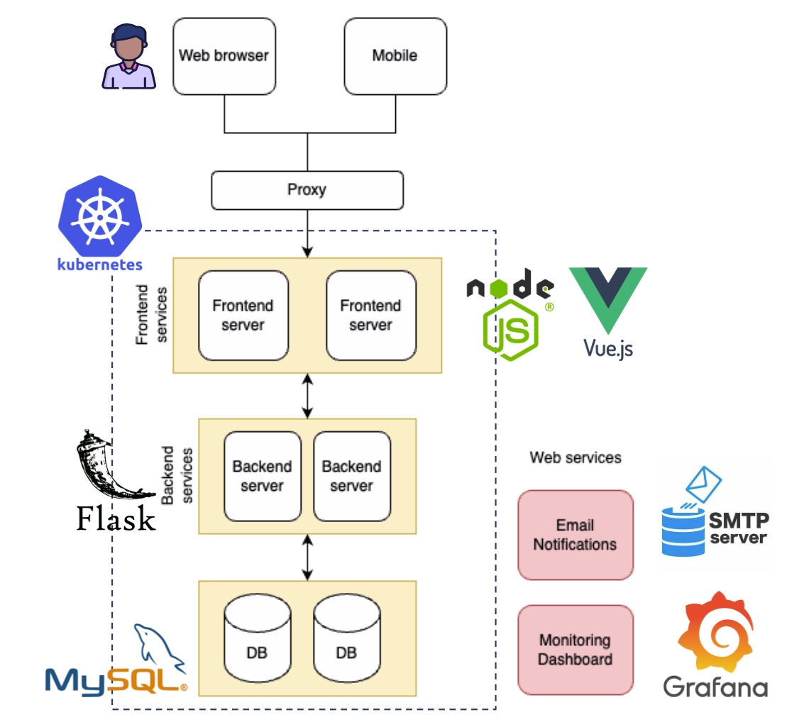

## Introduction

We built a ticket-based system (like Jira) for wafer quality management, where users can create requests by choosing labs, setting urgency (e.g., normal, urgent, critical), uploading files, and tracking progress—while lab engineers get prioritized task lists, real-time updates, and tools to approve, complete, or reject tasks with proper permission control.

### Our Goals:

- Sort/filter requests based on urgency level
- Send real-time email notifications to approvers
- Allow users to complete or reject requests
- Update request status
- Permission control

### Sysem Architecture

* Frontend: Vue.js + nodejs
* Backend: Flask
* Database: mysql
* Mail notification: google smtp
* Monitoring: Grafana

### Monitoring

We leverage Grafana to monitor the k8s clusters:

* Data Requested
* Requested Errors
* Dashboard View Counts
* CPU Usage
* MEM Usage
* Cluster Logs
